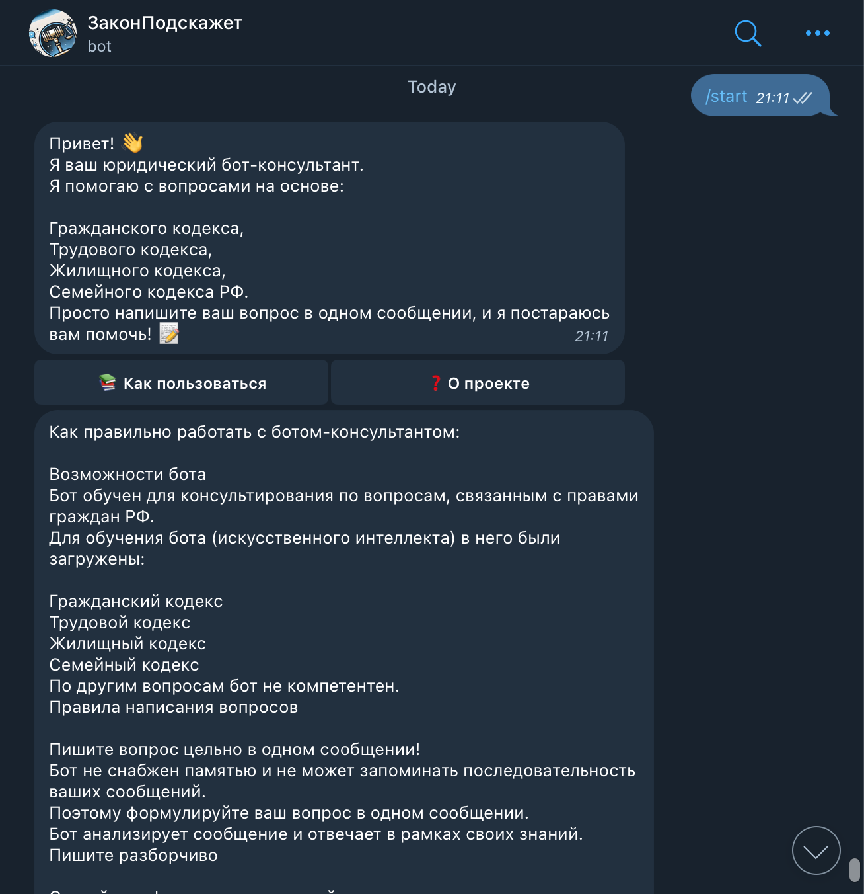

### ЗаконПодскажет - бот консультант по юридическим вопросам.

---
Этот бот предоставляет общую информацию на основе Гражданского кодекса, Трудового кодекса, Жилищного кодекса и Семейного кодекса РФ. Ответы носят справочный характер и не заменяют консультацию с квалифицированным юристом. Разработчики не несут ответственности за решения, принятые на основе предоставленной информации.

- Политика конфиденциальности
Сбор данных
Бот не собирает и не хранит персональные данные пользователей. Запросы и ответы обрабатываются анонимно.

- Использование данных
Вся информация, предоставляемая пользователем, используется исключительно для формирования ответа в рамках функционала бота.

- Защита данных
Мы принимаем технические меры для защиты данных, чтобы предотвратить их утечку или несанкционированное использование.

- Ограничение ответственности
Разработчики бота не несут ответственности за возможные последствия использования информации, полученной через данный бот.

- Обновление политики
Политика конфиденциальности может быть изменена. Актуальная версия всегда доступна при использовании бота.

---

Stack:

- Python TelegramBotAPI
- Pinecon SDK client
- Vector Database - Pinecon
- Кодексы РФ